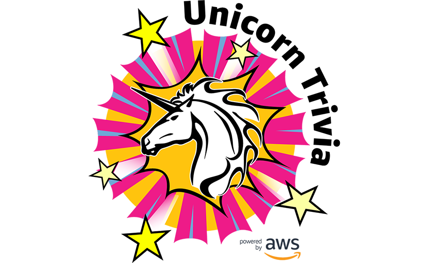

UnicornTrivia is a Silicon Valley-based, stealth startup building the next big thing in entertainment - a live gameshow app where anyone can tune-in and compete for prize money by answering trivia questions. Built with a great and performant tech stack to ship quickly including AWS Appsync, AWS Amplify, and AWS Elemental, that can remove a lot of the heavy lifting in building a mobile apps and video streaming services.

**Live Streaming Service** - This service will encode and host a live video stream from a studio environment to the end users playing UnicornTrivia.

**Administrator Panel** - This allows a host to submit questions and collect answers from participants.

**Client** - This allows users to connect to the live stream and answer questions during the show using iOS, Android, and/or a web browser.

## License

This library is licensed under the Apache 2.0 License.
